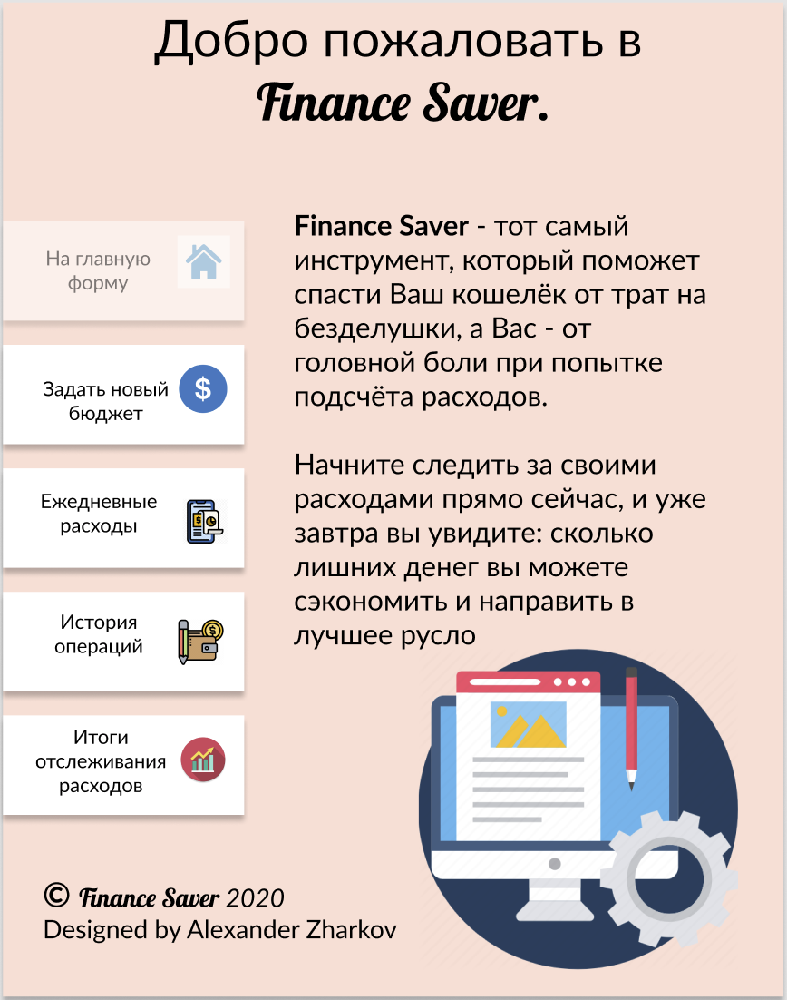
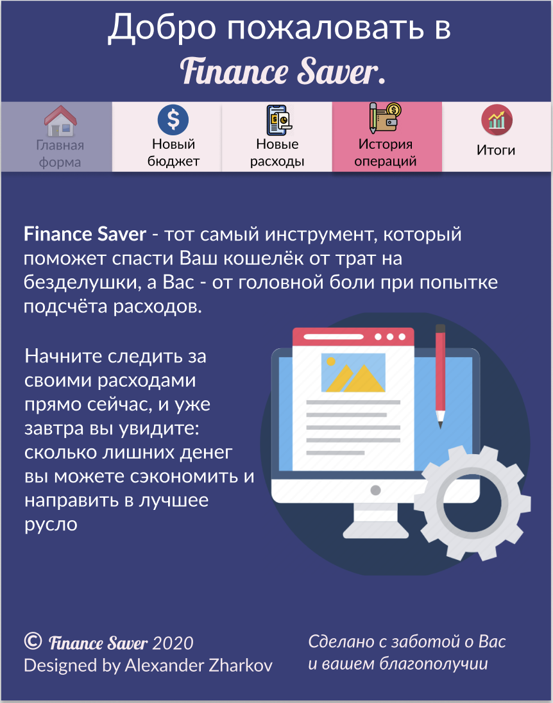
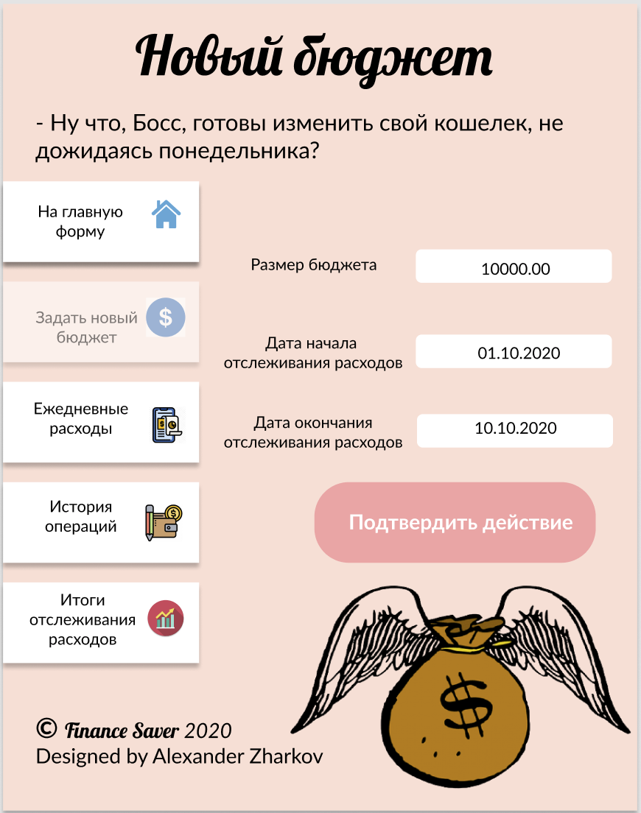
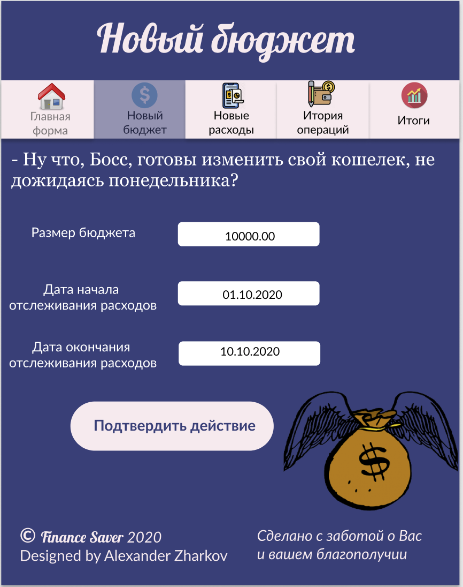
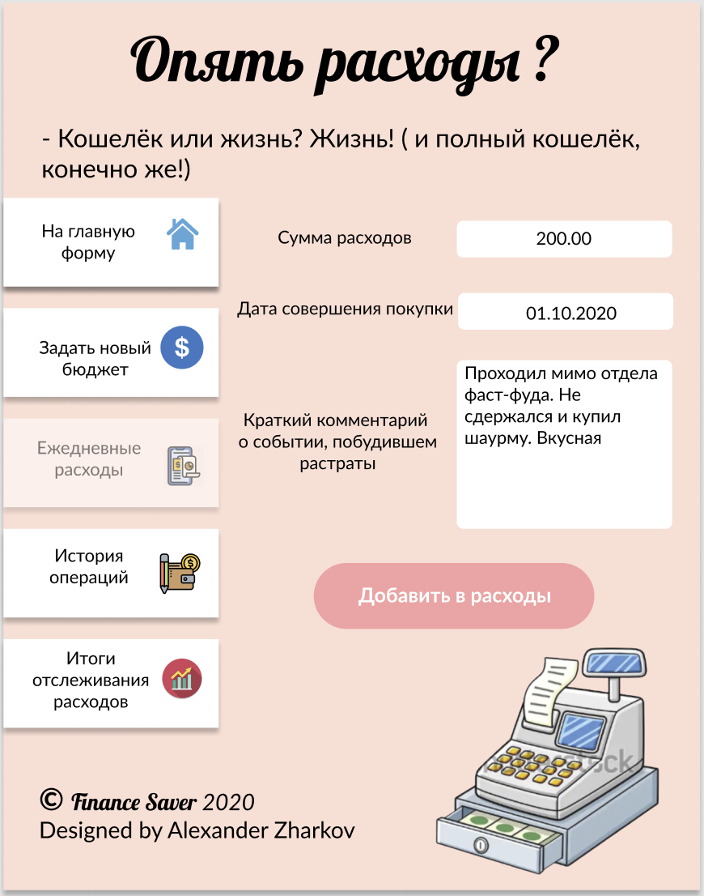
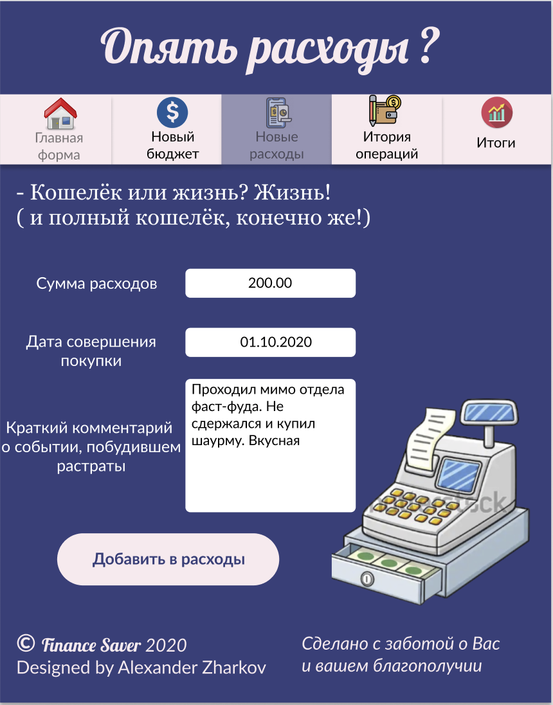
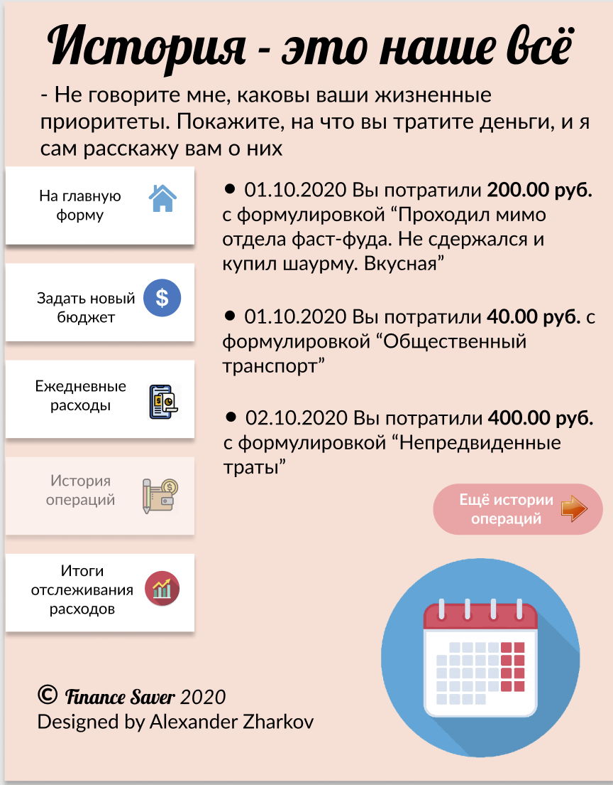
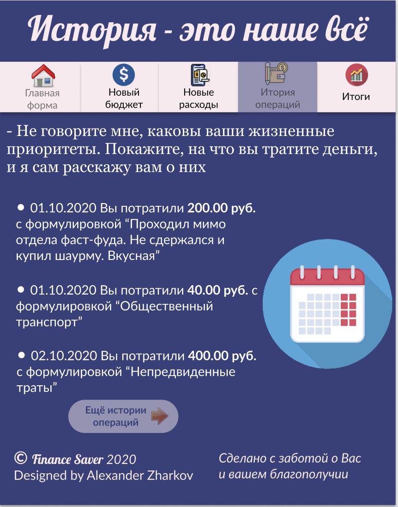
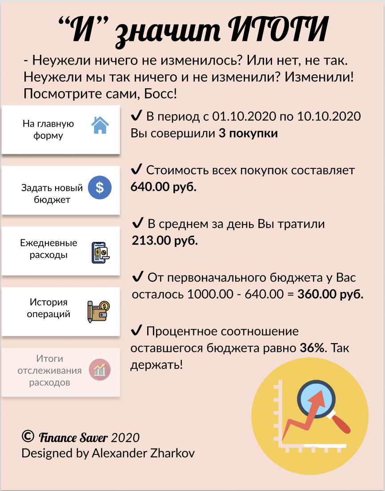
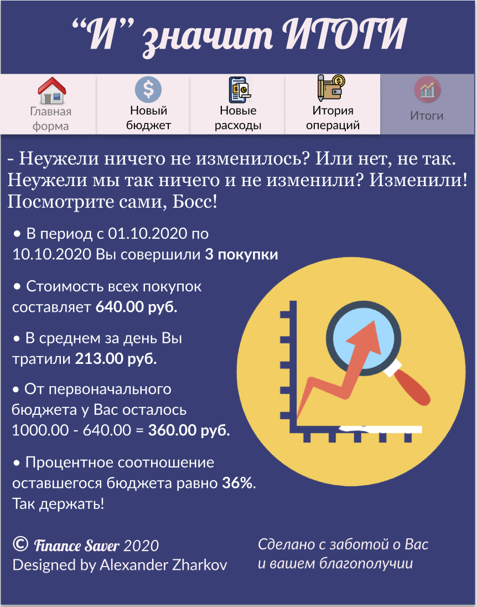

# Expense tracker project

### Table of Contents

- [Description](#description)
- [Preview](#preview)
- [How To Use](#how-to-use)
- [Author info](#author)

---

## Description

This project is one of the checkpoints of the college discipline called "UI project works". The main feature of this project is its design. I created it all by myself using Figma. There were two variants of design to choose from so I picked the dark one because this version is more attractive in my opinion. However the project is still raw, but I've achieved my goal to create a cool design and I want to share it. All variants are also available through the link
https://www.figma.com/file/yUUESKEyi0aG1kkLH1cGDo/%D0%9F%D1%80%D0%BE%D0%B5%D0%BA%D1%82%D0%B8%D1%80%D0%BE%D0%B2%D0%B0%D0%BD%D0%B8%D0%B5-%D0%B8%D0%BD%D1%82%D0%B5%D1%80%D1%84%D0%B5%D0%B9%D1%81%D0%B0-%D0%BF%D0%BE%D0%BB%D1%8C%D0%B7%D0%BE%D0%B2%D0%B0%D1%82%D0%B5%D0%BB%D1%8F?node-id=0%3A1.
So check it out and give your opinion

#### Technologies

- Python v3.7

- Tkinter - one of the python libraries

---

## Previews

|           Design version 1            |           Design version 2            |
| :-----------------------------------: | :-----------------------------------: |
|  |  |
|  |  |
|  |  |
|  |  |
|  |  |

## How to use

Just download or clone package from https://github.com/Alex-2kZharkov/Expense-tracker.git and run main.py file using code editors that allows to code in python.

---

## Author info

Write me to alexander.06.zharkov@gmail.com if you have any thoughts about this project or something like internship/job offer
